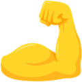

# Slack Custom Emoji

I've stolen most of these, but most of them are the obvious choices from the first page of a google images search for the object, possibly filtering by icon size.

The ones I made (by compiling existing images) are

This one is a [PRN code](http://www.navipedia.net/index.php/GNSS_signal)

I highly recommend the reverse muscle emoji so you can use the arms in combination with other emoji. Even better, use the `bicep` ones so that they're uniform across browsers.

Muscle Parrot:

  

Obligatory link to [`:partyparrot:`](http://cultofthepartyparrot.com/)